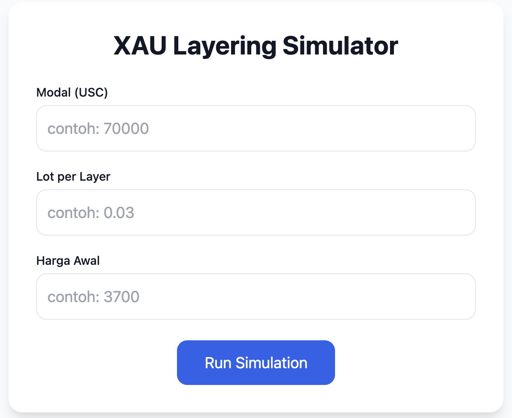

# 🌟 XAU Layering Simulator

[](https://xau-layering.vercel.app)
[](https://tailwindcss.com/)
[](https://www.chartjs.org/)
[](./LICENSE)

🚀 **XAU Layering Simulator** adalah web interaktif untuk mensimulasikan strategi layering *buy-only* pada **XAUUSD (Gold)**.  
Aplikasi ini membantu trader memahami **drawdown**, **pembagian modal per bucket**, dan **potensi stop-out** saat harga turun ekstrem.

 
<sub>Contoh tampilan simulator</sub>

---

## ✨ Fitur Utama
- 📝 **Form input sederhana** → hanya `Modal`, `Lot/layer`, dan `Harga awal`.
- 📊 **Buckets otomatis** → dibuat dari **⅓** & **⅔ modal**.
- 📈 **Summary interaktif** → menampilkan layer STOP, floating loss, equity minimum, max drawdown, dll.
- 🔢 **Tabel Layer** → rincian per layer (harga, floating loss, equity).
- 📉 **Grafik Equity vs Harga** → memvisualisasikan penurunan modal secara real-time.
- 🎨 **UI bersih & responsif** dengan TailwindCSS + Chart.js.

---

## 🛠️ Cara Pakai (User)
1. Buka [🌐 Demo di Vercel](https://xau-layering.vercel.app).
2. Isi parameter:
   - **Modal (USC)** → contoh: `70000`
   - **Lot per Layer** → contoh: `0.03`
   - **Harga Awal** → contoh: `3700`
3. Klik **Run Simulation** → hasil muncul:
   - Buckets otomatis
   - Summary
   - Tabel Layer
   - Grafik Equity

---

## 💻 Cara Run Lokal (Developer)

Clone repo:
```bash
git clone https://github.com/<username>/xau-layering-simulator.git
cd xau-layering-simulator
